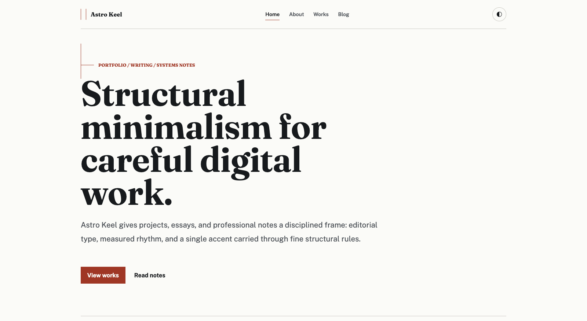
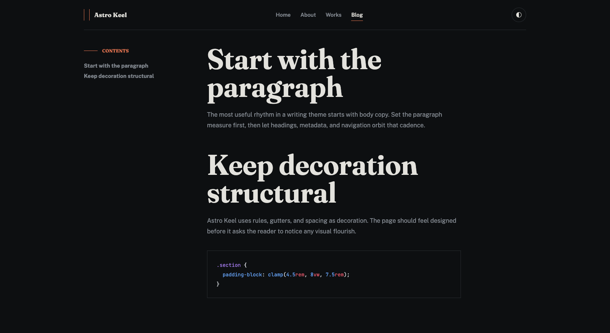
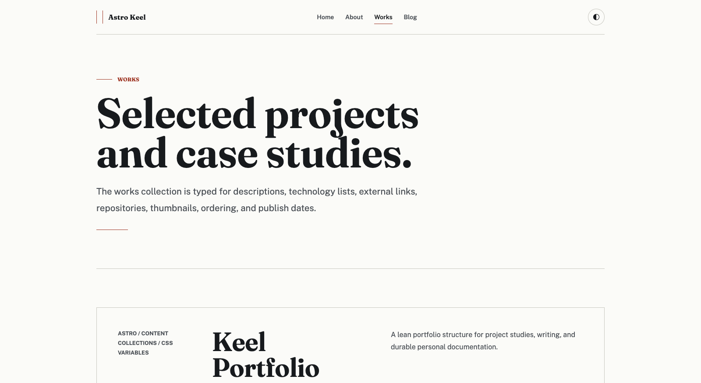

<div align="center">

# ⌁ Astro Keel

**A minimal, neutral, and modern portfolio + blog theme for Astro.**

A calm neutral base, a single configurable accent color, generous whitespace, and clean editorial typography — built on Astro 7 with Content Collections, tags, an RSS feed, and first-class dark mode.

<br />

[](https://kpab.github.io/astro-keel/)

<br />

[](#lighthouse)

[](https://weshipd.com/templates/astro-keel)

<br />

[](https://github.com/kpab/astro-keel/actions/workflows/deploy.yml)
[](./LICENSE)
[](https://github.com/kpab/astro-keel/stargazers)
<br />
[](https://astro.build)
[](https://www.typescriptlang.org)
[](https://nodejs.org)
[](https://mdxjs.com)

<br />

<picture>
  <source media="(prefers-color-scheme: dark)" srcset=".github/assets/preview-dark.png" />
  
</picture>

<table>
  <tr>
    <td></td>
    <td></td>
  </tr>
</table>

</div>

> **Keel** — the structural backbone of a ship. The name reflects the design intent: stripped of ornament, all structure and spine.

> [!NOTE]
> **Building a directory or listings site?** Check out **[Almanac](https://almanac.p4ni.com)** —
> a premium Astro + Cloudflare directory theme by the same author, with full-text search,
> an admin panel, moderated submissions, and monetization built in.

## Features

- **Portfolio + blog** — dedicated `works` and `blog` content collections with individual pages.
- **One-file site config** — site name, description, nav, and footer live in `src/consts.ts`.
- **One-line accent color** — retune the whole theme by changing a single CSS variable (`--color-accent`).
- **Light + dark mode** — respects `prefers-color-scheme` and remembers a manual toggle (no flash on load).
- **Self-hosted type** — Fraunces (display), Public Sans (body), and JetBrains Mono (code) via `@fontsource`, no external font CDN.
- **i18n-ready** — every UI string lives in a typed dictionary under `src/i18n/`; one `SITE.locale` line switches the chrome, date formats, `<html lang>`, and the RSS language. `en` and `ja` included.
- **Tags** — per-tag archive pages at `/blog/tags/[tag]`.
- **Pagination** — blog and tag archives paginate every 10 posts with hairline prev/next links.
- **Static search** — zero-backend full-text search at `/search` powered by [Pagefind](https://pagefind.app/), indexed at build time.
- **Auto OG images** — per-post and per-work Open Graph images rendered at build time with `satori` + `sharp`.
- **Table of contents** — blog posts get an auto-generated sidebar TOC from their headings.
- **Optional comments** — [Giscus](https://giscus.app) threads on blog posts, opt-in via `src/consts.ts`, lazy-loaded and theme-synced; disabled builds ship zero Giscus bytes.
- **RSS feed** — generated at `/rss.xml` with `@astrojs/rss`.
- **Syntax highlighting** — Shiki dual themes (light/dark) wired to the active color scheme.
- **SEO-ready** — canonical URLs, Open Graph, Twitter cards, and a sitemap out of the box.
- **JSON-LD structured data** — `WebSite` on the home page, `BlogPosting` + `BreadcrumbList` on posts (author configurable via `SITE.author` in `src/consts.ts`).
- **Responsive & accessible** — fluid type, hairline structure, visible focus rings.
- **One-click deploy** — bundled GitHub Pages workflow; or ship the static `dist/` to Cloudflare Pages, Vercel, Netlify, or any static host.

## Lighthouse

Every page of the demo scores **100 across all four categories** — with search,
pagination, and generated OG images all switched on.

| Page                               | Performance | Accessibility | Best Practices | SEO |
| ---------------------------------- | :---------: | :-----------: | :------------: | :-: |
| Home `/`                           |     100     |      100      |      100       | 100 |
| Blog index `/blog/`                |     100     |      100      |      100       | 100 |
| Blog post `/blog/baseline-rhythm/` |     100     |      100      |      100       | 100 |
| Works `/works/`                    |     100     |      100      |      100       | 100 |
| Search `/search/`                  |     100     |      100      |      100       | 100 |

<sub>Lighthouse 13.4.1, desktop preset, local production build. Reproduce it yourself:</sub>

```sh
npm run build && npm run preview
npx lighthouse http://localhost:4321/astro-keel/ --preset=desktop --view
```

Measured locally on purpose. First Contentful Paint, Largest Contentful Paint,
Total Blocking Time, and Cumulative Layout Shift are perfect against the hosted
demo too, but Speed Index swings with network conditions — repeated runs against
GitHub Pages land anywhere from 0.3 s to 1.9 s, which is enough to move the
Performance score between 97 and 100. A local build measures the theme rather
than the hop to the CDN.

## Tech stack

Astro 7 · TypeScript · Content Collections (Content Layer API) · MDX · `@astrojs/sitemap` · `@astrojs/rss` · Shiki. Requires **Node.js 22+**.

## Quick start

Scaffold a new project directly from this template:

```sh
npm create astro@latest -- --template kpab/astro-keel
```

Or click **Use this template** on GitHub, then:

```sh
npm install
npm run dev      # start the dev server at http://localhost:4321
npm run build    # build the static site to ./dist
npm run preview  # preview the production build
```

## Configuration

### Site identity

Site name, default meta description, RSS description, share image, nav items, and footer text all live in one file — `src/consts.ts`:

```ts
export const SITE = {
  title: 'Astro Keel',
  description: 'A minimal, neutral, and modern portfolio and blog theme for Astro.',
  author: 'Your Name', // emitted in JSON-LD BlogPosting; '' omits it
  // ...
};
```

### Social links

Declare social profiles in `src/consts.ts` — they render as inline SVG icons in the footer (self-hosted, `currentColor`, so they follow light/dark automatically):

```ts
export const SOCIAL_LINKS: readonly SocialLink[] = [
  { label: 'GitHub', href: 'https://github.com/<user>/<repo>', icon: 'github' },
  { label: 'RSS feed', href: '/rss.xml', icon: 'rss' },
];
```

Built-in icons: `github`, `x`, `linkedin`, `rss`, `email`. Site-root paths (like `/rss.xml`) get the configured `base` applied automatically; `mailto:` and full URLs are used as-is.

### Language

Set `SITE.locale` in `src/consts.ts` to a BCP 47 tag. One line switches every
string the theme renders, plus `<html lang>`, `og:locale`, date formatting, and
the RSS `<language>` element — no template edits:

```ts
export const SITE = {
  locale: 'ja', // ← 'en' and 'ja' ship with the theme
  // ...
};
```

Dates go through `Intl.DateTimeFormat`, so field order follows the locale too
(`March 9, 2026` → `2026年3月9日`).

#### Adding a language

1. Copy `src/i18n/ja.ts` to `src/i18n/<tag>.ts` and translate the values. The
   file is typed as `UIStrings`, so a missing or misspelled key is a build
   error rather than a silent fallback to English.
2. Register it in `src/i18n/index.ts`:

   ```ts
   import { fr } from './fr';

   export const DICTIONARIES: Record<string, UIStrings> = { en, ja, fr };
   ```

3. Set `SITE.locale` to the new tag.

`src/i18n/en.ts` is the reference dictionary and defines the shape — add new
keys there first. It holds **UI chrome only** (navigation, pagination, button
and section labels, aria labels, the 404 copy): roughly 60 short strings, so a
new locale is a small pull request. The placeholder prose on the home and about
pages stays in those `.astro` files, where you would edit it anyway.

Regional variants fall back to their base language's strings (`en-GB` uses the
`en` dictionary) while keeping their own date format, so they only need their
own file if the wording actually differs.

Nav labels come from the same dictionary via `labelKey`. A page you add yourself
can skip the dictionary and use a literal `label` instead — the type requires
exactly one of the two:

```ts
export const NAV_ITEMS: readonly NavItem[] = [
  { href: '/', labelKey: 'nav.home' },
  { href: '/uses/', label: 'Uses' },
];
```

> [!NOTE]
> **Non-Latin scripts and generated images.** The OG image route bundles
> **Latin subsets** of Fraunces and Public Sans to keep builds light, and Satori
> draws any missing glyph as an empty box. Post titles in a non-Latin script
> need a font that covers it — install e.g. `@fontsource/noto-sans-jp` and point
> `src/pages/og/[collection]/[slug].png.ts` at it. (The theme's own labels in
> those images stay Latin for this reason.)
>
> Pagefind indexes by the document's `lang`, so `<html lang="ja">` gets proper
> Japanese segmentation. Its Default UI strings ("Search", "Clear") are
> translated for many languages but not all — check yours.

### Comments (optional)

Blog posts can carry a [Giscus](https://giscus.app) thread — comments backed by
GitHub Discussions, so there is still no backend to run. **Off by default:** with
`enabled: false`, not a single byte of Giscus markup, CSS, or script reaches the
browser — the whole component, styles included, sits behind the flag.

To turn it on:

1. Make the repository public and enable **Discussions** in its settings.
2. Install the [giscus GitHub App](https://github.com/apps/giscus) on it.
3. Fill in the generated values from [giscus.app](https://giscus.app) in
   `src/consts.ts`:

```ts
export const GISCUS: GiscusConfig = {
  enabled: true,
  repo: '<user>/<repo>',
  repoId: 'R_...', // from giscus.app
  category: 'Announcements',
  categoryId: 'DIC_...', // from giscus.app
  mapping: 'pathname', // survives retitling, unlike 'title'
  // ...
};
```

The widget loads only when the reader scrolls near it (`IntersectionObserver`),
so it never competes with the article for bandwidth, and its theme follows the
header's light/dark toggle live — set `lightTheme` / `darkTheme` to any Giscus
theme name or a URL to your own theme CSS. If the embed never appears — a
content blocker, an offline reader, or an unfinished repository setup — a link
to the discussion thread replaces it rather than leaving an empty box.

### Site URL

Set your deployed URL in `astro.config.mjs` — it powers canonical links, the sitemap, and RSS:

```js
export default defineConfig({
  site: 'https://your-domain.com',
  // ...
});
```

### Base path

Internal links and assets are routed through a `withBase()` helper (`src/lib/url.ts`), so the theme works whether it's served from a domain root or a subpath. Serving from a subpath — like a GitHub Pages **project site** at `https://<user>.github.io/<repo>/` — just needs `site` + `base`:

```js
export default defineConfig({
  site: 'https://<user>.github.io',
  base: '/<repo>',
});
```

For a custom domain or a `<user>.github.io` **root site**, omit `base` (or set it to `'/'`).

## Customization

### Accent color

Change one line in `src/styles/global.css`. Hover and soft variants derive automatically:

```css
:root {
  --color-accent: oklch(0.54 0.14 35); /* ← your brand color */
}
```

### Fonts

Font families are CSS variables (`--font-display`, `--font-body`, `--font-mono`) in `src/styles/global.css`. Swap a face by installing another `@fontsource` package, importing it in `src/layouts/BaseLayout.astro`, and updating the variable.

### Dark mode

Neutral palettes for both schemes live in `src/styles/global.css` under `:root`, `[data-theme='light']`, and `[data-theme='dark']`. The toggle in the header persists the choice to `localStorage`.

## Authoring content

Add Markdown/MDX files under `src/content/`:

- `src/content/works/*.md` — portfolio entries
- `src/content/blog/*.md` — blog posts

### Works frontmatter

<!-- prettier-ignore -->
```yaml
---
title: Project name
description: One-line summary.
tech: ['Astro', 'TypeScript']
link: https://example.com        # optional — live link
repo: https://github.com/...     # optional — source
thumbnail: ./cover.png           # optional — relative image
order: 1                         # optional — manual sort
publishDate: 2026-06-01
---
```

### Blog frontmatter

<!-- prettier-ignore -->
```yaml
---
title: Post title
publishDate: 2026-06-01
description: One-line summary for listings, SEO, and RSS.
tags: ['design', 'astro']
draft: false                     # true hides it from build output
heroImage: ./hero.png            # optional — relative image
---
```

## Project structure

```
src/
  consts.ts          # site name, description, locale, nav, footer
  content/           # works/ and blog/ Markdown & MDX entries
  content.config.ts  # collection schemas (Content Layer API)
  i18n/              # UI dictionaries (en, ja) + t() and formatDate()
  layouts/           # BaseLayout (head, nav, theme toggle)
  pages/             # routes: /, /about, /works, /blog, tags, rss.xml
  styles/            # global.css design tokens
astro.config.mjs     # site URL, integrations, Shiki config
```

## Deployment

### GitHub Pages

A workflow at `.github/workflows/deploy.yml` builds the site and publishes it on every push to `main`.

1. Set `site` and `base` in `astro.config.mjs` to match your repository (see [Base path](#base-path)).
2. In the repository, go to **Settings → Pages** and set **Source** to **GitHub Actions**.
3. Push to `main` (or run the workflow manually from the **Actions** tab). Your site goes live at `https://<user>.github.io/<repo>/`.

### Other static hosts

`npm run build` emits a static `dist/` that deploys as-is to Cloudflare Pages, Vercel, Netlify, or any static host. Drop `base` from `astro.config.mjs` when serving from a domain root.

## Changelog

Notable changes are recorded in [CHANGELOG.md](./CHANGELOG.md), and tagged
versions are published as [GitHub Releases](https://github.com/kpab/astro-keel/releases).
Because this is a template rather than a dependency, upgrading means porting the
changes you want into your own copy — each entry names the files it touches.

## Contributing

Bug reports, docs fixes, and focused pull requests are welcome. See
[CONTRIBUTING.md](./CONTRIBUTING.md) for dev setup, project structure, and the
two design rules the theme holds to (zero client JS by default; all
configuration in `src/consts.ts`).

## More themes by kpab

- **[Almanac](https://almanac.p4ni.com)** (premium) — a directory theme on Astro + Cloudflare
  Workers + D1: bm25 full-text search, admin panel, moderated submissions, and featured-listing
  monetization. [Get it on Gumroad →](https://kpab.gumroad.com/l/almanac)
- [astro-haze](https://github.com/kpab/astro-haze) — glassmorphism theme for blogs, portfolios & landing pages
- [Kepler](https://github.com/kpab/astro-kepler) — navy × orange theme for blogs, portfolios & landing pages
- [Darkness](https://github.com/kpab/astro-darkness) — dark portfolio theme with a Three.js particle background

## License

[MIT](./LICENSE)
